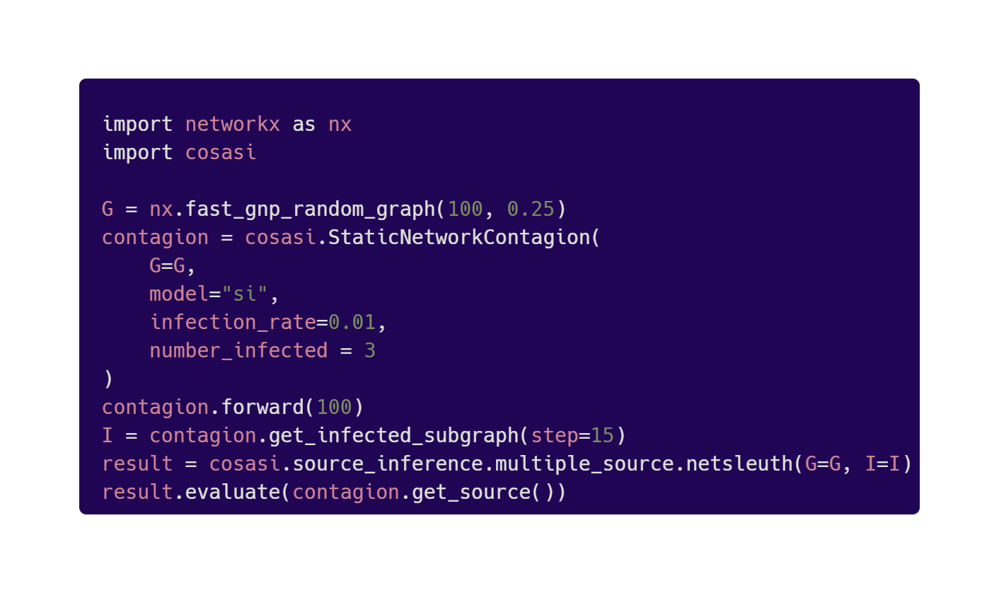

[](https://badge.fury.io/py/cosasi)
[](https://cosasi.readthedocs.io/en/latest/?badge=latest)
[](https://pepy.tech/project/cosasi)
[](https://lbesson.mit-license.org/)

# cosasi (COntagion Simulation And Source Identification)

``cosasi`` is a Python package for graph diffusion source inference, allowing users to:

- **perform and evaluate** source inference using standard techniques from literature,
- **contribute** innovative localization methods to a growing core library, and
- **benchmark** new techniques against a battery of comparable schemes.


## Table of Contents
* [Table of Contents](#table-of-contents)
* [Installation](#installation)
* [Getting Started](#getting-started)
* [Code Snippet](#code-snippet)
* [Testing](#testing)
* [Contributions](#contributions)
* [Support](#support)
* [Contact](#contact)
* [License](#license)


## Installation

#### Installation via PyPI
```bash
pip install cosasi
```

#### Installation via GitHub
Clone the repo from [here](https://github.com/lmiconsulting/cosasi) (this repo).

Install requirements:
```bash
pip install -r requirements.txt
```

## Getting Started
Once `cosasi` is installed, feel free to review our [tutorial](https://cosasi.readthedocs.io/en/latest/tutorial.html) introducing major functionality. Official documentation, including a detailed [API reference](https://cosasi.readthedocs.io/en/latest/apiref.html), is available on [Read the Docs](https://cosasi.readthedocs.io/).


## Code Snippet

|  |
|:--:|
| Above: [Carbon](https://github.com/carbon-app/carbon) image of example code snippet; copy-and-paste-able version below. |


```python
import networkx as nx
import cosasi

G = nx.fast_gnp_random_graph(100, 0.25)
contagion = cosasi.StaticNetworkContagion(
   G=G,
   model="si",
   infection_rate=0.01,
   number_infected=3,
)
contagion.forward(100)
I = contagion.get_infected_subgraph(step=15)
result = cosasi.source_inference.multiple_source.netsleuth(G=G, I=I)
result.evaluate(contagion.get_source())
```

## Testing

Extensive unit testing is employed throughout, with ~97% code coverage.

If you've cloned our repo from [GitHub](https://github.com/lmiconsulting/cosasi), you can cd into the root directory and run [pytest](https://docs.pytest.org/en/7.1.x/contents.html) via [coverage](https://coverage.readthedocs.io/en/6.3.2/):

```bash
    coverage run -m pytest
```

To read the .coverage file:

```bash
    coverage report
```


## Contributions

We’d love your help! If you’d like to make an addition or improvement, please submit a pull request consisting of an atomic commit and a brief message describing your contribution.

Our contributor guide is [here](https://cosasi.readthedocs.io/en/latest/developer_pages/contributing.html), and we itemize a few areas of development we’d like to prioritize for the future of `cosasi` [here](https://cosasi.readthedocs.io/en/latest/developer_pages/roadmap.html). If you find something wrong, please submit a bug report to the [issue tracker](https://github.com/lmiconsulting/cosasi/issues). For other questions or comments, feel free to [contact us](#contact) directly.


## Support

`cosasi` was developed in [Forge](https://www.lmi.org/forge), the technology accelerator of the [Logistics Management Institute](https://www.lmi.org/about-lmi).

## Contact

Questions? Reach out:
- Lucas ([email](mailto:lmccabe@lmi.org))


## License
[MIT](https://choosealicense.com/licenses/mit/)
